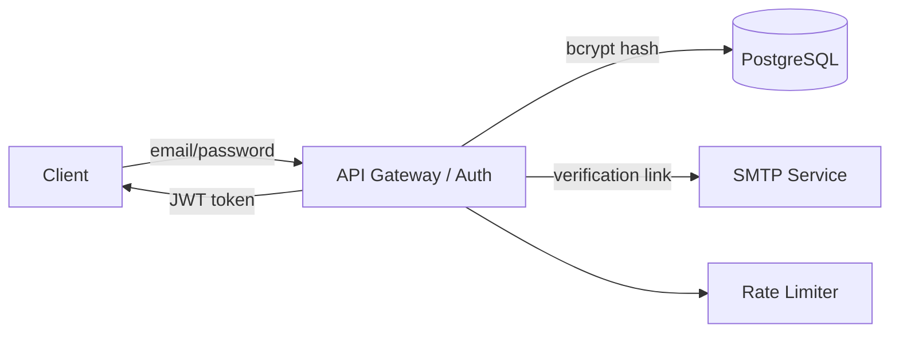

Этот файл - индивидуальный. Его проверяют по rubric_TM.md (5 критериев × {0/1/2} → 0-10).
Все доказательства/скрины кладите в EVIDENCE/ и ссылайтесь на конкретные файлы/якоря.

0) Мета

Проект (опционально BYO): «Учебный шаблон» — аутентификация и управление сессиями
Кратко (1-2 предложения): Веб-сервис с REST API, поддерживающий регистрацию и вход через email/password. Пользователи — клиенты (браузер/мобильное приложение), администраторы (через панель управления).

1) Архитектура и границы доверия (TM1, S04)

Роли/активы:  
  Пользователь: вводит email/password, получает JWT  
  Администратор: управляет аккаунтами через панель  
  Активы: персональные данные (email, хеш пароля), JWT, логи аутентификации

Зоны доверия:  
  Internet (недоверенная): клиенты  
  DMZ: API Gateway, Auth Service  
  Internal: PostgreSQL, SMTP Service  
  Device: доверенные админ-устройства

- **Context/DFD:**

Критичные интерфейсы и допущения:  
  Интерфейс /auth/login — публичный, требует защиты от брутфорса  
  Внутренние вызовы (API → DB, API → SMTP) — в защищённой сети, но не доверяются полностью  
  Админ-панель доступна по отдельному домену, требует MFA  
  Секреты (JWT secret, SMTP credentials) — хранятся в зашифрованном виде, не в коде

2) Реестр угроз STRIDE (TM2, TM3, S04)

| ID  | STRIDE | Компонент/поток         | Угроза (кратко)                                   | L | I | L×I |
|-----|--------|--------------------------|----------------------------------------------------|---|---|-----|
| T01 | S  | B (Auth Service)         | Подмена личности с поддельным JWT                 | 4 | 5 | 20  |
| T02 | T  | A → B (email/password)   | Перехват и повтор отправки кредов (replay)         | 3 | 5 | 15  |
| T03 | R  | B (логи аутентификации)  | Отказ от действия: нет привязки запроса к user_id  | 3 | 4 | 12  |
| T04 | I  | B → C (SQL)              | SQL-инъекция при поиске пользователя               | 2 | 5 | 10  |
| T05 | D  | B (/auth/login)          | DoS через массовые запросы входа                  | 5 | 4 | 20  |
| T06 | E  | B (логи)                 | Обход блокировки через смену IP                   | 3 | 4 | 12  |
| T07 | I  | B → D (verification link)| Утечка email в логах SMTP-интеграции               | 4 | 4 | 16  |
| T08 | S  | A (Client)               | Использование украденного токена с другого устройства | 4 | 5 | 20  |

3) Приоритизация и Top-5 (TM3, S04)

1) T05 DoS на /auth/login — L×I=20  
   → Высокая экспозиция: публичный эндпоинт.  
   → Частая атака: автоматизированные брутфорс-боты.  
   → Влияние: отказ в обслуживании для легитимных пользователей.

2) T01 Подмена JWT — L×I=20  
   → Уязвимости в библиотеках (alg=none, weak secret).  
   → Влияние: полный доступ к аккаунту без пароля.

3) T08 Украденный токен — L×I=20  
   → Токены хранятся в localStorage — уязвимы к XSS.  
   → Чувствительность данных: доступ к ПДн.

4) T07 Утечка email в логах SMTP — L×I=16  
   → Логи могут попасть в SIEM, мониторинг, бэкапы.  
   → Нарушение GDPR, даже без пароля.

5) T02 Replay атака на /auth/login — L×I=15  
   → Возможна при компрометации трафика (MITM).  
   → Защита: HTTPS + short-lived сессии.

4) Требования (S03) и ADR-решения (S05) под Top-5 (TM4)

NFR-1. Защита аутентификации

AC (GWT):  
  Given валидный JWT, When запрос к /api/profile, Then 200 и X-User-ID=...  
  Given поддельный/просроченный JWT, When запрос, Then 401, событие auth.token_invalid в аудите

NFR-2. Защита от DoS и брутфорса

AC (GWT):  
  Given 6 запросов /auth/login с одного IP за 5 минут, When 6-й запрос, Then 429, блокировка на 15 мин  
  Given успешный вход, When последующие запросы, Then rate limit сбрасывается

NFR-3. Защита PII в логах

AC (GWT):  
  Given вызов /auth/register, When логирование, Then email и password замаскированы как *  
  Given вызов SMTP, When логирование, Then verification link не содержит полного email

Краткие ADR (минимум 2) - архитектурные решения S05

ADR-001 - Внедрить rate limiting на /auth/login

Context (угрозы/NFR): T05, NFR-2; публичный эндпоинт
Decision: Ограничить 5 запросов с одного IP за 5 минут. Блокировка 15 мин. Реализация на API Gateway.
Trade-offs: Возможные ложные срабатывания при NAT; небольшое влияние на UX.
DoD: 429 при превышении; p95 latency < 100ms при нагрузке

ADR-002 - Маскировать PII в логах и внешних интеграциях
Context (угрозы/NFR): T07, NFR-3; утечка email в логах SMTP и аудите
Decision: Внедрить middleware, которое автоматически заменяет email, password, token на *** до записи в лог. Применяется на уровне API Gateway и сервиса.
Trade-offs: Усложнение логики логирования; сложнее отладка при реальных проблемах (но можно включить debug-режим с шифрованием).
DoD: В логах и в EVIDENCE/log-anonymized.json нет реальных email; SAST не находит строк log.*email без маскировки.

